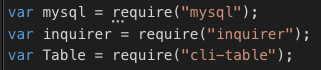
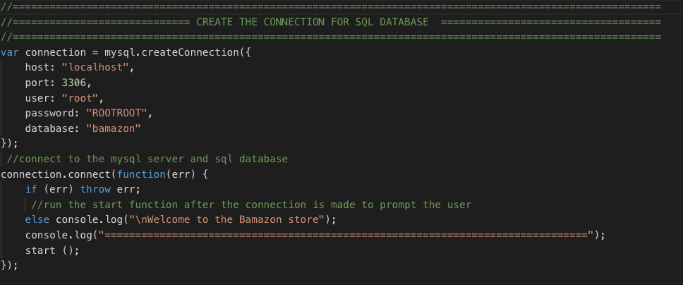
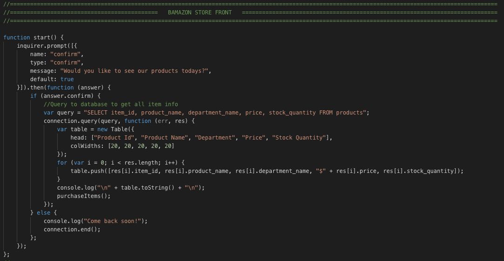
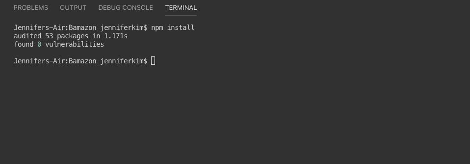
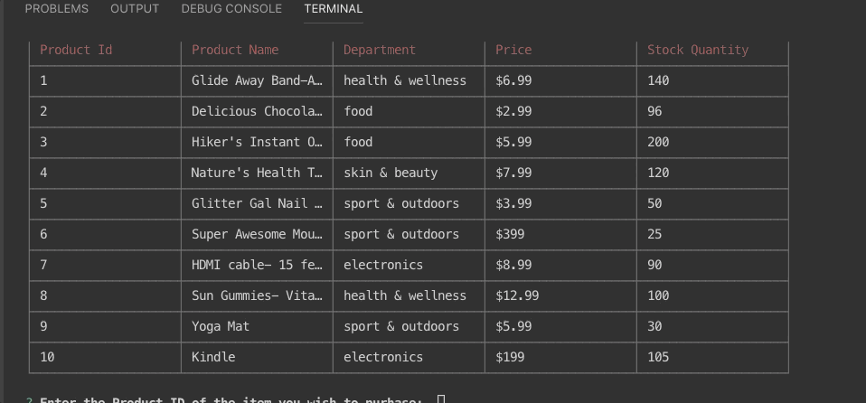
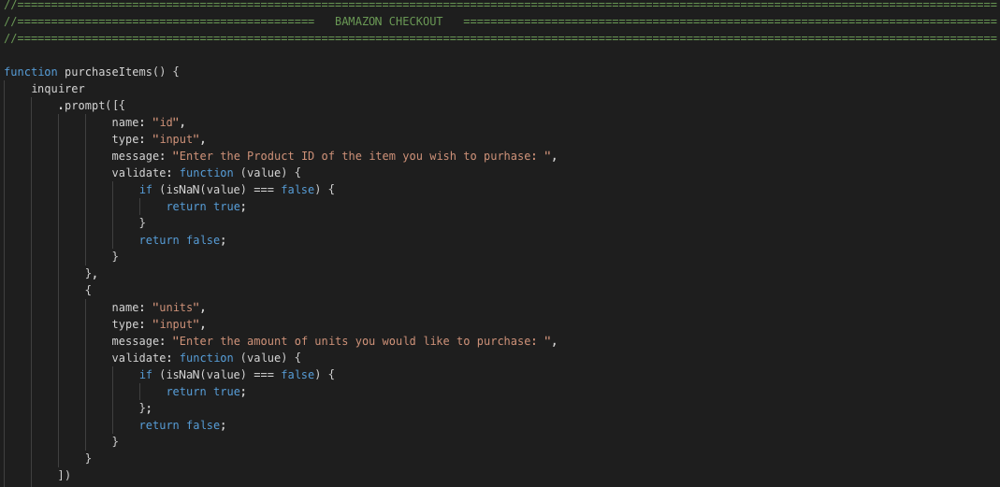

# Bamazon

## Overview
In this project I created  an Amazon-like storefront with MySQL Database.  The app will take in orders from customers and deplete stock from the store's inventory.

### Expected Outcomes
The Bamazon app was designed to create a amazon store front interface through node. Despite having only 10 products in its categories, it will show the stock quantity depleting and the checkout total as the user goes from the storefront to the checkout steps. 

### Built with

- [JavaScript] (https://www.javascript.com/) - The programs in this language are called scripts. They can be written right in a web page’s HTML and run automatically as the page loads.
- [Node.js] (https://nodejs.org/en/)- Node.js is a cross-platform JavaScript runtime environment that allows developers to build server-side and network applications with JavaScript.
- [MySQL WorkBench] (https://www.mysql.com/products/workbench/)- MySQL Workbench is a unified visual tool for database architects, developers, and DBAs. MySQL Workbench provides data modeling, SQL development, and comprehensive administration tools for server configuration, user administration, backup, and much more. MySQL Workbench is available on Windows, Linux and Mac OS X.

#### Node Packages used
- [MySQL] (https://www.npmjs.com/package/mysql)- This is a node.js driver for mysql. It is written in JavaScript and does not require compiling.
- [Inquirer] (https://www.npmjs.com/package/inquirer)- A collection of common interactive command line user interfaces.
- [Cli-Table] (https://www.npmjs.com/package/cli-table)- This utility allows you to render unicode-aided tables on the command line from your node.js scripts.

### Functionality
--- 
**1**   `Download NPM Packages`
        
 
        
The first portion of my code requires the app the installl these three npm packages in order for the rest of the code to work. 

**2**   `Create a Connection and Port` 

**3**   `Function for Bamazon Store Front` 
        

`Functiion start ()` is the function that will launch our app with an inquirer message asking the user if they would like to see our Bamazon products. If they answer "Y" (yes) then it will do a query pull from our bamazon database, a database we created in MySQL Workbench. If the user chooses "n" (no), then they will be prompted with a `come back soon!`. 

Now we can see this function in action when we launch the app with `node <file-name>`

Once you hit **YES** you will see the Bamazon store front and all of the items that are in our inventory. Along with the items id, name, department, price, and stock quantity.

**4**    `do-what-it-says` 
        
    node liri.js do-what-it-says

This command will select the request in the random.txt file and produce a search. In this particular repo, we have the `spotify-this-song,"I Want it That Way". `

