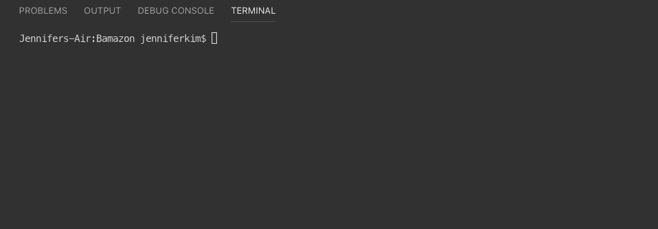

# Bamazon

## Overview
In this project I created  an Amazon-like storefront with MySQL Database.  The app will take in orders from customers and deplete stock from the store's inventory.

### Expected Outcomes
The Bamazon app was designed to create a amazon store front interface through node. Despite having only 10 products in its categories, it will show the stock quantity depleting and the checkout total as the user goes from the storefront to the checkout steps. 

### Built with

- [JavaScript] (https://www.javascript.com/) - The programs in this language are called scripts. They can be written right in a web page’s HTML and run automatically as the page loads.
- [Node.js] (https://nodejs.org/en/)- Node.js is a cross-platform JavaScript runtime environment that allows developers to build server-side and network applications with JavaScript.
- [MySQL WorkBench] (https://www.mysql.com/products/workbench/)- MySQL Workbench is a unified visual tool for database architects, developers, and DBAs. MySQL Workbench provides data modeling, SQL development, and comprehensive administration tools for server configuration, user administration, backup, and much more. MySQL Workbench is available on Windows, Linux and Mac OS X.

#### Node Packages used
- [MySQL] (https://www.npmjs.com/package/mysql)- This is a node.js driver for mysql. It is written in JavaScript and does not require compiling.
- [Inquirer] (https://www.npmjs.com/package/inquirer)- A collection of common interactive command line user interfaces.
- [Cli-Table] (https://www.npmjs.com/package/cli-table)- This utility allows you to render unicode-aided tables on the command line from your node.js scripts.

### Functionality
--- 
**1**   `Download NPM Packages`
        
  ![Please Download these packages first] (./screenshots/ss1.png)
        
This command takes the user search request for artist in the bandsintown api, and returns the next concert time and date for that artist, as well as location and city.In this project, I set the default artist search to "Ariana Grande".

**2**   `spotify-this-song` 
        
    node liri.js spotify-this-song

This command takes the user search request for songs/artist in the spotify api, and returns the artist, full track name, a preview link and the album. In this project, I set the default spotify song search to "The Sign".

**3**   `movie-this` 
        
    node liri.js movie-this

This command takes the user's search request for movies in the OMDB api, and returns title, cast, release date, ratings, country of origin, original language and synopsis. In this project, I set the default movie search to "Mr.Nobody".

**4**    `do-what-it-says` 
        
    node liri.js do-what-it-says

This command will select the request in the random.txt file and produce a search. In this particular repo, we have the `spotify-this-song,"I Want it That Way". `

